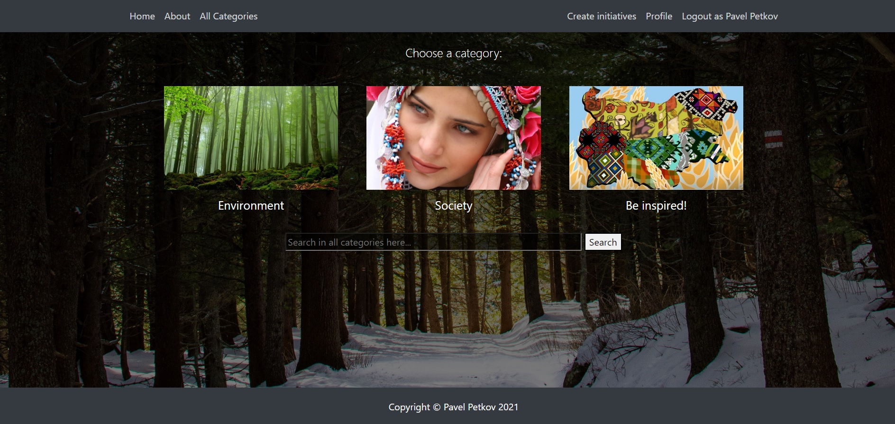

## Application for charity initiatives

 

 - This is my very first backend application.
 - Used Express, Handlebars, MongoDB & Mongoose. 
 - This application is still under construction - and there are many new features in the pipeline for it.
 
## Functionality
- Register, login in application, logout, view pages as guest.
- Create initiatives in different categories.
- Like, join and comment in others' initiatives.
- Edit, delete your own ones.
- Search in all categories for an initiative.
- View own profile with all created and joined initiatives.
- Others.
